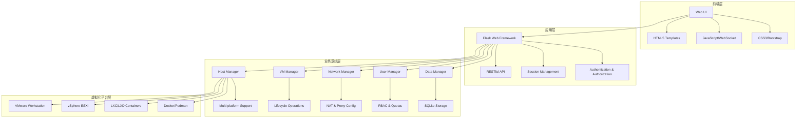

# 项目介绍

## 什么是 OpenIDCS？

OpenIDCS（Open Internet Data Center System）是一个开源的IDC（Internet Data Center）虚拟化统一管理平台，旨在简化多虚拟化环境下的虚拟机管理工作。它提供了一个统一的Web管理界面和完整的RESTful API，让运维人员可以轻松地管理分布在多个虚拟化平台上的虚拟机集群。

## 项目背景

在现代数据中心环境中，企业往往需要同时使用多种虚拟化技术：
- **VMware** 用于生产环境
- **Docker/Podman** 用于容器化应用
- **LXC/LXD** 用于轻量级虚拟化
- **其他虚拟化平台** 满足特定需求

这种多样化的虚拟化环境带来了管理上的挑战：
- 需要学习和使用多个不同的管理工具
- 难以统一监控和管理资源
- 用户权限和配额管理复杂
- 缺乏统一的操作日志和审计

OpenIDCS 正是为了解决这些问题而诞生的。

## 核心优势

### 🎯 统一管理界面

通过单一的Web界面管理所有虚拟化平台，无需在多个管理工具之间切换。

### 🔌 RESTful API

完整的API支持，可以轻松集成到现有的运维系统和自动化流程中。

### 🌐 跨平台支持

支持 Windows、Linux、macOS 等多种操作系统，可以从任何地方访问和管理。

### 👥 多租户架构

内置的用户管理和权限控制系统，支持多团队、多用户的协作使用。

### 📊 实时监控

实时监控虚拟机和主机的资源使用情况，及时发现和解决问题。

### 🔒 安全可靠

支持 TLS 加密通信、基于角色的访问控制（RBAC）、完整的操作日志记录。

## 技术架构

OpenIDCS 采用前后端分离的架构设计：

### 技术栈

| 层级 | 技术组件 | 版本要求 |
|------|----------|----------|
| **前端** | HTML5/CSS3/jQuery/Bootstrap | - |
| **后端** | Python Flask | >= 2.0.0 |
| **数据库** | SQLite | - |
| **日志** | Loguru | >= 0.6.0 |
| **HTTP客户端** | Requests | >= 2.28.0 |
| **系统监控** | psutil/GPUtil | >= 5.9.0/1.4.0 |
| **虚拟化** | pyvmomi/pylxd/docker | 可选依赖 |

## 适用场景

### 🏢 中小企业IT部门
统一管理公司内的开发、测试、生产环境虚拟机。

### ☁️ 私有云运维
作为私有云平台的轻量级管理前端。

### 🎓 教育培训机构
为实验室或培训中心提供虚拟机资源共享平台。

### 🔬 研发团队
管理开发测试环境的虚拟机集群。

### 🏭 传统IDC转型
帮助传统IDC服务商提供虚拟化服务。

## 项目状态

OpenIDCS 目前处于活跃开发状态，主要功能已经稳定可用：

| 平台 | 状态 | 支持的操作系统 | 架构 |
|------|------|----------------|------|
| LXC/LXD | ✅ 已实现 | Windows, Linux | x86_64, ARM64 |
| Docker/Podman | ✅ 已实现 | Windows, Linux, macOS | x86_64, ARM64 |
| VMware Workstation | ✅ 已实现 | Windows | x86_64 |
| Proxmox VE | 🚧 开发中 | Windows, Linux | x86_64, ARM64 |
| VMware vSphere ESXi | 🚧 开发中 | Windows, Linux, macOS | x86_64, ARM64 |
| Windows Hyper-V | 🚧 开发中 | Windows | x86_64 |
| Oracle VirtualBox | 📋 计划中 | Windows, Linux | x86_64, ARM64 |
| QEMU & KVM | 📋 计划中 | Windows, Linux, macOS | x86_64, ARM64 |

## 开源协议

OpenIDCS 采用 **GNU Affero General Public License v3.0 (AGPLv3)** 开源协议。

这意味着：
- ✅ 可以自由使用、修改和分发
- ✅ 可以用于商业用途
- ⚠️ 修改后的代码必须开源
- ⚠️ 网络服务也需要提供源代码

详细信息请查看 [开源协议](/about/license) 页面。

## 致谢

OpenIDCS 的部分代码和设计灵感来自以下开源项目：

- **魔方财务-LXD对接服务器** by xkatld
  - 项目地址：https://github.com/xkatld/zjmf-lxd-server
  - 受控端Web和魔方对接插件风格与部分代码基于此项目

感谢所有为开源社区做出贡献的开发者们！

## 下一步

- 📖 查看 [功能概览](/guide/features) 了解详细功能
- 🚀 阅读 [快速上手](/guide/quick-start) 开始使用
- 💬 加入我们的 [社区讨论](https://gitter.im/OpenIDCSTeam/community)
